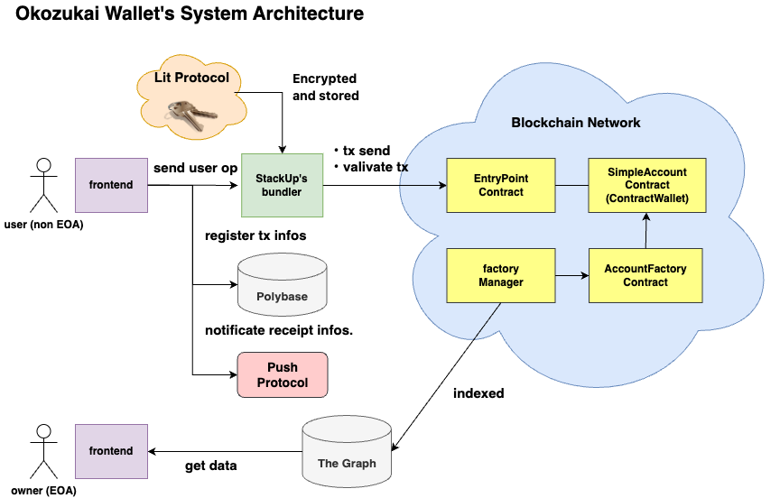
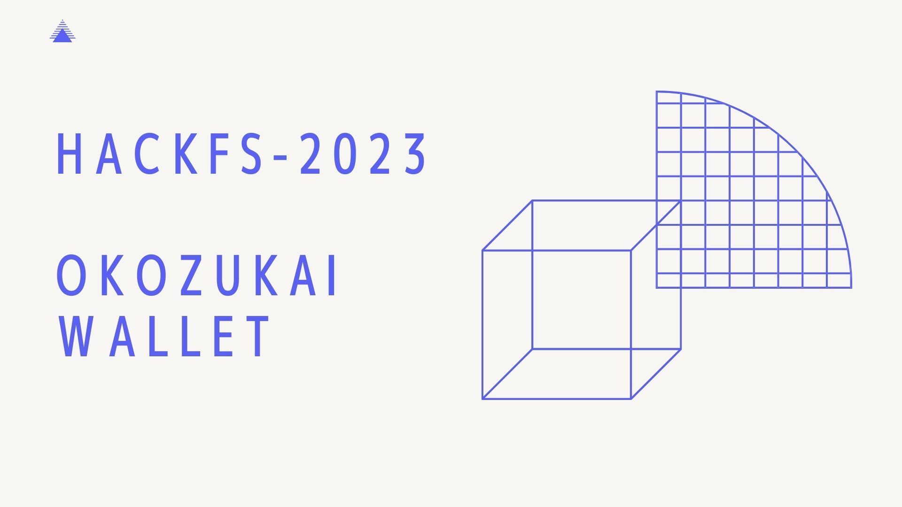
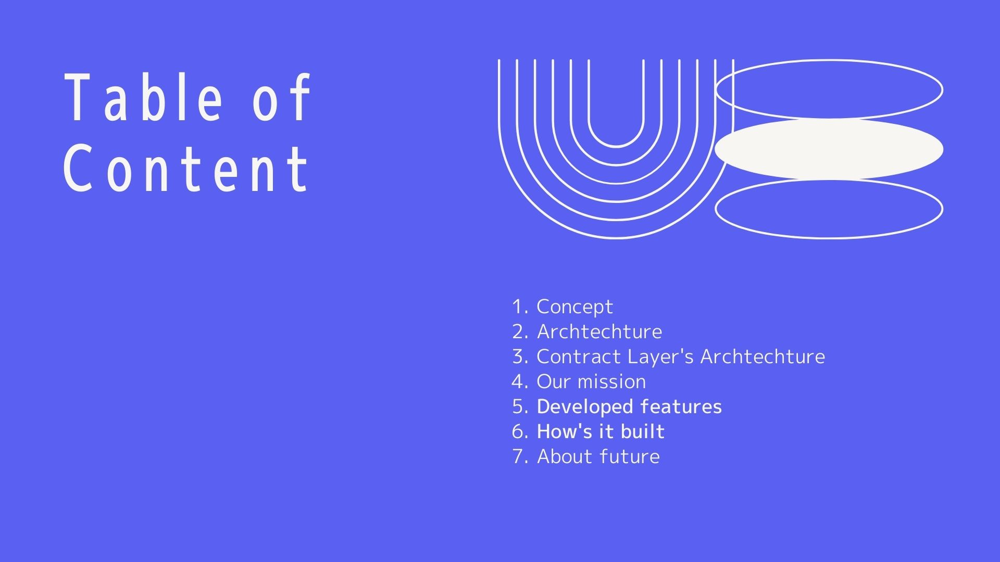
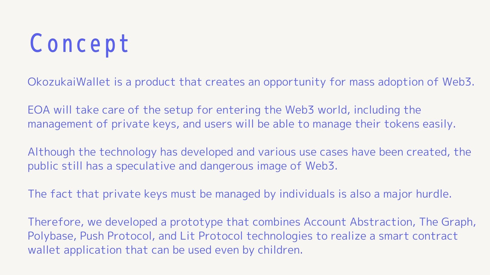
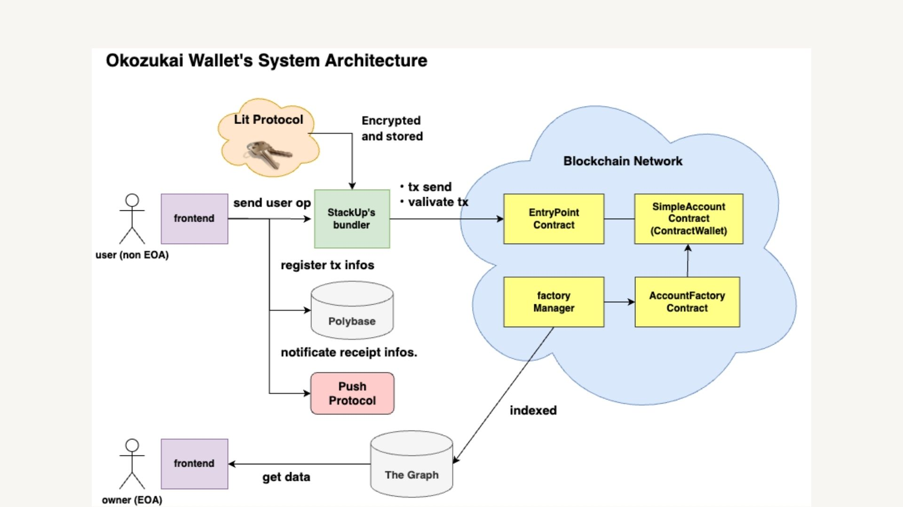
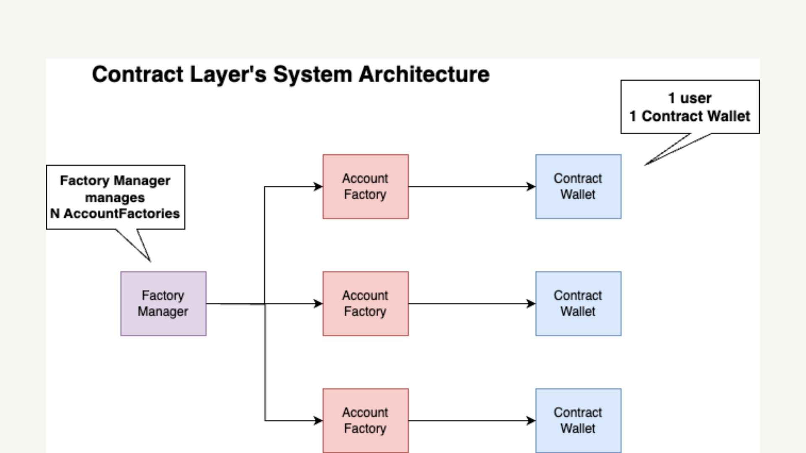
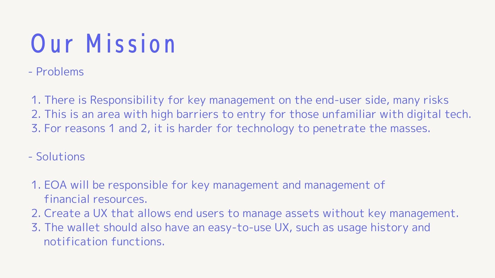
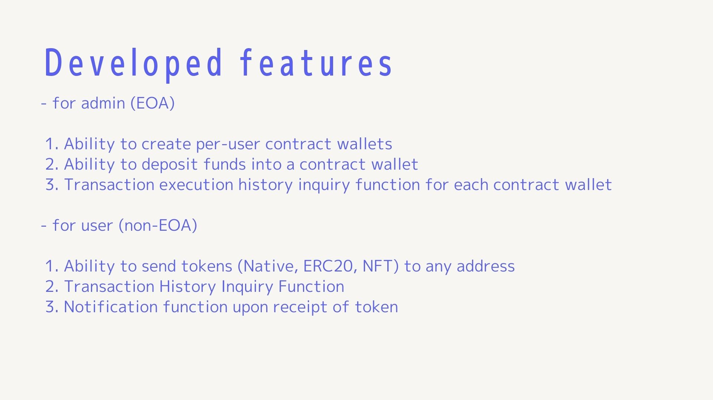
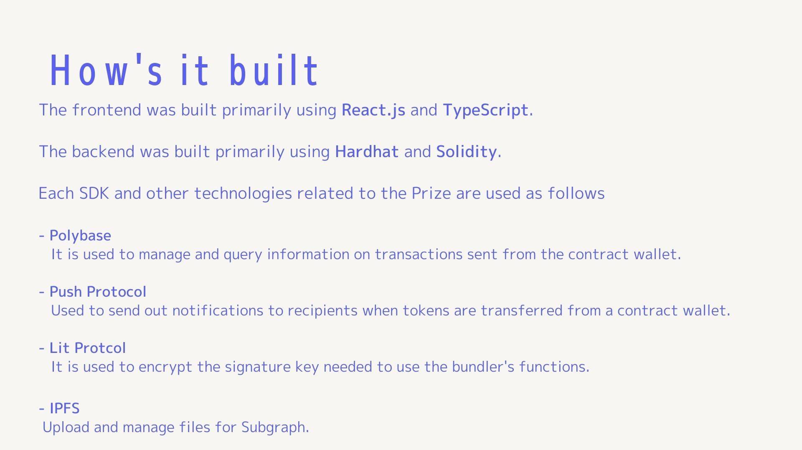
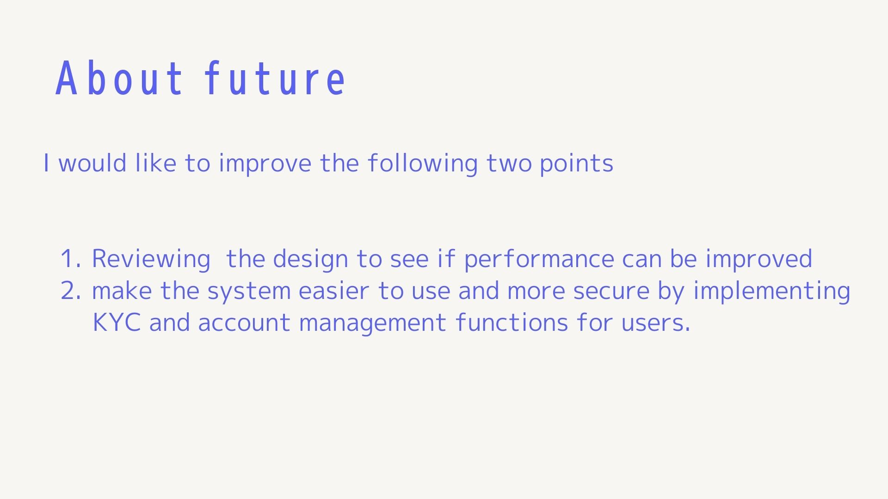

# OkozukaiValut

<div align="center">
   
</div>

This is a repo of OkozukaiValut ( AA + hardhat + React.js + Push Protocol + The Graph + Polybase + LitProtocol )

## Description

OkozukaiValut is a product that creates an opportunity for mass adoption of Web3.

EOA will take care of the setup for entering the Web3 world, including the management of private keys, and users will be able to manage their tokens easily.

Although the technology has developed and various use cases have been created, the public still has a speculative and dangerous image of Web3.

The fact that private keys must be managed by individuals is also a major hurdle.

Therefore, we developed a prototype that combines Account Abstraction, The Graph, Polybase, Push Protocol, and Lit Protocol technologies to realize a smart contract wallet application that can be used even by children.

Someone who can properly understand the concept of EOA will manage the setup and financial resources. From there, assets are deposited into a contract wallet for the user.

The user has the authority to operate the deposited assets, and can transfer money at any time at the user's will.
However, the private key signature is not required.

Polybase and Push Protocol technologies are also combined to provide instant access to information necessary for wallet management.

## Archtechture



## Mission

- Problems

  1. There is Responsibility for key management on the end-user side, many risks
  2. This is an area with high barriers to entry for children and those unfamiliar with digital technology.
  3. For reasons 1 and 2, it is harder for technology to penetrate the masses.

- Solutions

  1. EOA will be responsible for key management and management of the major financial resources.
  2. Create a UX that allows end users to manage assets without key management.
  3. The wallet should also have an easy-to-use UX, such as usage history and notification functions.

## Developed features

- for admin (EOA)

  1. Ability to create per-user contract wallets
  2. Ability to deposit funds into a contract wallet
  3. Transaction execution history inquiry function for each contract wallet

- for user (non-EOA)

  1. Ability to send tokens (Native, ERC20, NFT) to any address
  2. Transaction History Inquiry Function
  3. Notification function upon receipt of token

## What I tried

I developed Dapp for the first time using the Push Protocol SDK and the Polybase and Lit Protocol SDKs.
The most difficult part was researching the features and functions of each protocol and assembling them into a single app based on account abstractions.

After conducting technical verification by referring to the starter kit and Get Started documentation, we incorporated the functions into the main application.

## Contract Info

| No. | Cotract Name   | Address                                                                                                                         | Network |
| :-- | :------------- | :------------------------------------------------------------------------------------------------------------------------------ | :------ |
| 1   | FactoryManager | [0x8eD85ab44b29286D878492da06c862770A078176](https://mumbai.polygonscan.com/address/0x8eD85ab44b29286D878492da06c862770A078176) | Mumbai  |
| 2   | LitNft         | [0x45892C0Cb0860f96BA6d36a8C0f967E517ab5105](https://mumbai.polygonscan.com/address/0x45892C0Cb0860f96BA6d36a8C0f967E517ab5105) | Mumbai  |

## Subgrph Info

[SubGraph Endpoint](https://api.studio.thegraph.com/query/44992/OkozukaiValut/v0.0.1)

- Sample Query

  ```gql
  query MyQuery {
    factoryCreateds(orderBy: id, orderDirection: desc) {
      factoryId
      factoryAddress
    }
  }
  ```

- Deployed Info

  ```bash
  ⠋ Upload subgraph to IPFS(node:9392) ExperimentalWarning: The Fetch API is an experimental feature. This feature could change at any time
  (Use `node --trace-warnings ...` to show where the warning was created)
                  .. QmetH7H6cWkiCAb1Va9nD2RY7U6DBsAErn91PcPjVvh6XM
    Add file to IPFS build/FactoryManager/abis/FactoryManager.json
                  .. QmfCrCkd43F9otUJ7MH76shKafHNsBygUF1qW5c4Bhjk5c
    Add file to IPFS build/FactoryManager/FactoryManager.wasm
                  .. QmRXuWw1rZGaCQJyg2FDTjMuobYNyqXY2sjNzHBUS7azKU
  ✔ Upload subgraph to IPFS

  Build completed: QmPKCkd51wUFWToUSottMUEXNEtuXFVAy1ocGQuFvFjCUZ

  Deployed to https://thegraph.com/studio/subgraph/OkozukaiValut

  Subgraph endpoints:
  Queries (HTTP):     https://api.studio.thegraph.com/query/44992/OkozukaiValut/v0.0.1
  ```

## Tech Stack

| No. | Name                |
| :-- | :------------------ |
| 1   | React.js            |
| 2   | Tailwind CSS        |
| 3   | ERC4337             |
| 4   | ERC20               |
| 5   | The Graph           |
| 6   | hardhat             |
| 8   | TypeScript          |
| 9   | Polybase SDK        |
| 10  | Account Abstraction |
| 11  | Push Protocol SDK   |
| 12  | openzeppelin        |
| 13  | ethers.js           |
| 14  | userOp.js           |
| 15  | yarn workspaces     |
| 16  | Spheron             |
| 17  | LitProtocol SDK     |
| 18  | Alchemy SDK         |
| 19  | IPFS                |
| 20  | Web3Auth            |

## How to run

- install

  ```bash
  yarn
  ```

- Smart Contract compile

  ```bash
  yarn backend:compile
  ```

- Smart Contract deploy

  ```bash
  yarn FactoryManager:deploy:mumbai
  ```

- Smart Contract verify

  ```bash
  yarn FactoryManager:verify:mumbai
  ```

- Subgraph build

  ```bash
  yarn subgraph:build
  ```

- Subgraph deploy

  ```bash
  yarn subgraph:deploy
  ```

- setup frontend `.env`

  The following environment variables must be filled in

  ```txt
  REACT_APP_RPC_URL=
  REACT_APP_ETH_MAINNET_RPC_URL=
  REACT_APP_BUNDLER_RPC_URL=
  REACT_APP_PAYMASTER_RPC_URL=
  REACT_APP_ALCHEMY_API_KEY=
  REACT_APP_PAYMASTER_CONTEXT=""
  REACT_APP_CONNECT_ADDRESS_PRIVATE_KEY=
  ```

- Frontend start

  ```bash
  yarn frontend_admin:start
  ```

  ```bash
  yarn frontend_user:start
  ```

  Let's access to [http://localhost:3000/](http://localhost:3000/)!!

## Live demo (Spheron)

※ To use the function for Admin, please access the site with a browser that has Metamask installed with a wallet address that holds at least 50 MATIC.

- [atached domain site https://mashharuki.com/](https://mashharuki.com/)
- [live demo - Spheron https://hackfs-2023-fad570.spheron.app](https://hackfs-2023-fad570.spheron.app)
- [Deployment Preview (filecoin network)](https://bafybeibbhw3e6xfsayjxqq6eiloaje6ggxyl3wzwuje2rcgprmvbjoi4qm.ipfs.sphn.link/)

## Live demo (Vercel)

- [live demo - Vercel https://hack-fs-2023-frontend.vercel.app/](https://hack-fs-2023-frontend.vercel.app/)

## Presentation Slide











### Reference

1. [EIP-4337](https://eips.ethereum.org/EIPS/eip-4337)
2. [FireWallet - Github](https://github.com/xwing-india/eth-india)
3. [Account-Abstruction](https://github.com/eth-infinitism/account-abstraction)
4. [NPM AccountAbstruction](https://www.npmjs.com/package/@account-abstraction/contracts)
5. [jiffyScan](https://www.jiffyscan.xyz/)
6. [【GitHub】jiffyScan](https://github.com/mashharuki/jiffy-explorer)
7. [【StackUp Docs】AA introduction](https://docs.stackup.sh/docs/introduction)
8. [AAsnap](https://github.com/a42io/AAsnap)
9. [stackup-bundler Sample source](https://github.com/stackup-wallet/stackup-bundler)
10. [【npm】Userop.js](https://www.npmjs.com/package/userop)
11. [MetaMask/snaps-monorepo](https://github.com/MetaMask/snaps-monorepo)
12. [extend-the-functionality-of-metamask](https://docs.metamask.io/guide/snaps.html#extend-the-functionality-of-metamask)
13. [Template Snap monorepo](https://github.com/MetaMask/template-snap-monorepo)
14. [Create a gas estimation snap](https://docs.metamask.io/snaps/tutorials/gas-estimation)
15. [Hardhat の使い方メモ(4) テスト - イベントのテスト方法](https://nawoo.hateblo.jp/entry/2021/11/15/223439)
16. [ERC4337 に関するメモ](https://scrapbox.io/m1dstream/EIP4337_%23Ethereum)
17. [発表資料](https://www.canva.com/design/DAFiCy3VhsI/KAkcUxU8fNhlMjUkeU0_eA/edit?utm_content=DAFiCy3VhsI&utm_campaign=designshare&utm_medium=link2&utm_source=sharebutton)
18. [tailwindcomponents](https://tailwindcomponents.com/component/bottom-and-header-nav-responsive)
19. [Alchemy ERC20Token Balance](https://docs.alchemy.com/reference/alchemy-gettokenbalances)
20. [NFT API Quickstart](https://docs.alchemy.com/reference/nft-api-quickstart)
21. [How to get all ERC20 tokens owned by an address](https://docs.moralis.io/web3-data-api/evm/how-to-get-all-erc20-tokens-owned-by-an-address)
22. [Ceramic × LitProtocol Example](https://developer.litprotocol.com/ToolsAndExamples/Integrations/Ceramic/installation)
23. [Lit Protocol Encryption & UploadIPFS](https://developer.litprotocol.com/SDK/Explanation/encryption)
24. [demo video (Operation) - Youtube ](https://youtu.be/uPXRCQGeYv8)
25. [Presentation Slide](https://www.canva.com/design/DAFmCdhBu4s/JhjM7jzOi58TJLyy1CIZ_g/edit?utm_content=DAFmCdhBu4s&utm_campaign=designshare&utm_medium=link2&utm_source=sharebutton)
